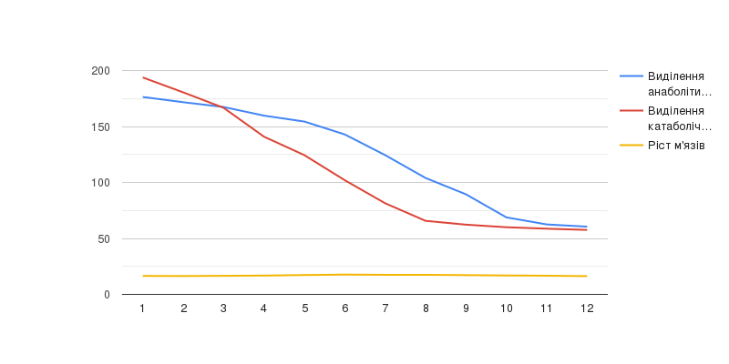
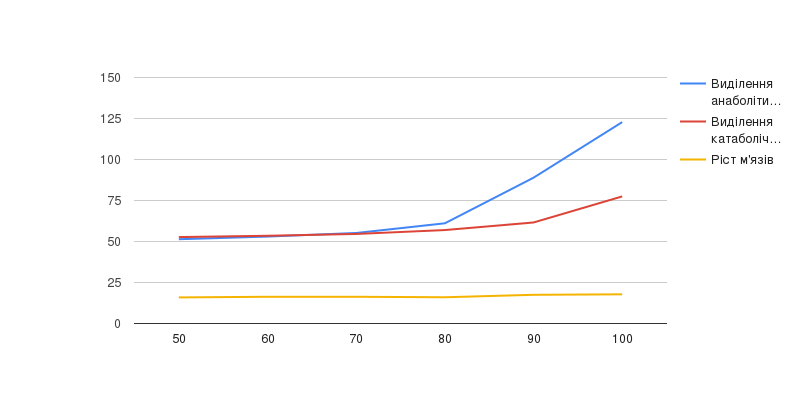
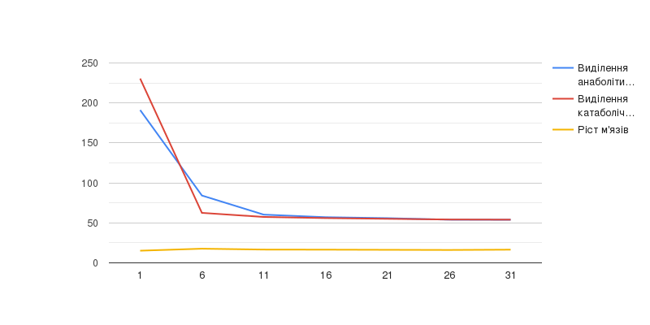

## Комп'ютерні системи імітаційного моделювання
## СПм-22-5, **Тимошенко Дар'я Олександрівна**
### Лабораторна робота №**1**. Опис імітаційних моделей та проведення обчислювальних експериментів

 

### Варіант 12, модель у середовищі NetLogo:
[Muscle Development](http://www.netlogoweb.org/launch#http://www.netlogoweb.org/assets/modelslib/Sample%20Models/Biology/Muscle%20Development.nlogo)

 

### Вербальний опис моделі:
Симуляція розвитку м'язів під час підняття ваги. Коли спостерігач активує м'язове волокно за допомогою тренування з обтяженнями, волокно випромінює хімічний сигнал, що призводить до викиду гормонів у місці розташування волокна. Ці гормони впливають на розвиток волокон та згодом зникають. Це фізіологічна модель вправ, яка описує фактори, що беруть участь у створенні гормонального балансу для розвитку м’язів під час підняття ваги.

### Керуючі параметри:
- **intensity** визначає інтенсивність тренування, від якої залежить залежить, наскільки ефективно будуть залучені всі м’язові волокна. Чим більша кількість залучених волокон, тим сильніший стимул зростання.
- **lift** визначає чи активно людина піднімає тяжкості, від частоти підняття тяжкості залежить відновлення мускулів та стимул їх зростання.
- **hours-of-sleep** визначає части сну для відновлення м'язів. Від сна залежить відновлення органзіму, та відповідно нарост м’язів.
- **days-between-workouts** визначає дні між тренуваннями. Частота тренувань впливає на те, скільки часу у тіла є для відновлення.
- **%slow-twitch-fibers** визначає ймовірність того, що кожне волокно матиме характеристики повільного скорочення.
  
### Внутрішні параметри:
- **anabolic** анаболічні гормони відновлюють м'язові волокна.
- **catabolic** катаболічні гормони руйнують м'язові волокна.
  
### Показники роботи системи:
- показники виділення анаболітичних та катаболічних гормонів;
- зростання м'язів в залежності від гормонів, що виділяються.

 

## Обчислювальні експерименти

### 1. Залежність росту м'язів від кількості годин сну
Досліджується залежність росту м'язів протягом певної кількості тактів (100) від кількості годин сну, зазначеного на початку симуляції.
Експерименти проводяться при 1-12 часів сну, з кроком 1, усього 12 симуляцій.  
Інші керуючі параметри мають значення за замовчуванням:
- **intensity**: 95;
- **lift**: 1;
- **days-between-workouts**: 5;
- **%slow-twitch-fibers**: 50.

<table>
<thead>
<tr><th>Кількість годин сну</th><th>Ріст м'язів</th></tr>
</thead>
<tbody>
<tr><td>1</td><td>15.19</td></tr>
<tr><td>2</td><td>15.85</td></tr>
<tr><td>3</td><td>16.5</td></tr>
<tr><td>4</td><td>16.6</td></tr>
<tr><td>5</td><td>17.6</td></tr>
<tr><td>6</td><td>18.7</td></tr>
<tr><td>7</td><td>18.6</td></tr>
<tr><td>8</td><td>18.6</td></tr>
<tr><td>9</td><td>18.3</td></tr>
<tr><td>10</td><td>17.9</td></tr>
<tr><td>11</td><td>17</td></tr>
<tr><td>12</td><td>16.6</td></tr>
</tbody>
</table>

Графік наочно показує, що при невеликій кількості годин сну, або навпаки надвеликій кількості годин сну м'язи скорочуються та не ростуть, оптимальна кількість годин сну для росту м'язів - це 6-8 годин сну.

 

### 2. Залежність росту м'язів від інтенсивності тренування
Досліджується залежність росту м'язів протягом певної кількості тактів (50) від інтенсивності тренування, зазначеного на початку симуляції.
Експерименти проводяться при 50-100 інтенсивності, з кроком 10, усього 6 симуляцій.  
Інші керуючі параметри мають значення за замовчуванням:
- **hours-of-sleep**: 8;
- **lift**: 1;
- **days-between-workouts**: 5;
- **%slow-twitch-fibers**: 50.

<table>
<thead>
<tr><th>Інтенсивність тренування</th><th>Виділення анаболітичного гормону</th><th>Виділення катаболічного гормону</th><th>Ріст м'язів</th></tr>
</thead>
<tbody>
<tr><td>50</td><td>51.4</td><td>52.7</td><td>15.9</td></tr>
<tr><td>60</td><td>53</td><td>53.5</td><td>16.3</td></tr>
<tr><td>70</td><td>55.2</td><td>54.6</td><td>16.3</td></tr>
<tr><td>80</td><td>61.1</td><td>57</td><td>16</td></tr>
<tr><td>90</td><td>88.9</td><td>61.6</td><td>17.5</td></tr>
<tr><td>100</td><td>122.8</td><td>77.5</td><td>17.8</td></tr>
</tbody>
</table>

Графік наочно показує, що при невеликій інтенсивності тренування виділяється майже однакова кількість анаболітитчного і катаболітичного гормону, що не дає великого розвитку м'яз, можна зробити висновок, що оптимальна інтенсивність тренування дорівнює 90.

 

### 3. Вплив періодичності тренування на ріст м'язів
Досліджується залежність росту м'язів протягом певної кількості тактів (50) від кількості днів між тренуваннями, зазначеного на початку симуляції.
Експерименти проводяться при 1-31 днів між тренуваннями, з кроком 5, усього 7 симуляцій.  
Інші керуючі параметри мають значення за замовчуванням:
- **hours-of-sleep**: 8;
- **lift**: 1;
- **intensity**: 95;
- **%slow-twitch-fibers**: 50.

<table>
<thead>
<tr><th>Інтенсивність тренування</th><th>Виділення анаболітичного гормону</th><th>Виділення катаболічного гормону</th><th>Ріст м'язів</th></tr>
</thead>
<tbody>
<tr><td>1</td><td>191.1<td><td>230.5</td><td>15.2</td></tr>
<tr><td>6</td><td>84.2</td><td>62.5</td><td>17.7</td></tr>
<tr><td>11</td><td>60.3</td><td>57.4</td><td>16.6</td></tr>
<tr><td>16</td><td>57.1</td><td>56</td><td>16.5</td></tr>
<tr><td>21</td><td>55.9</td><td>55.1</td><td>16.3</td></tr>
<tr><td>26</td><td>54</td><td>54.2</td><td>16.1</td></tr>
<tr><td>31</td><td>53.9</td><td>54</td><td>16.5</td></tr>
</tbody>
</table>

Графік наочно показує, що при періодичності тренування в один день м'язи не встигають відпочити та катаболічного гормону, що руйнує м'язи, виділяється більше, при великих інтервалах між тренуваннями анаболітичного та катаболічного гормонів виділяється майже однаково, що не сприяє створенню м'язів. Можна зробити висновок, що оптимальний час між тренуваннями 5-6 днів.

